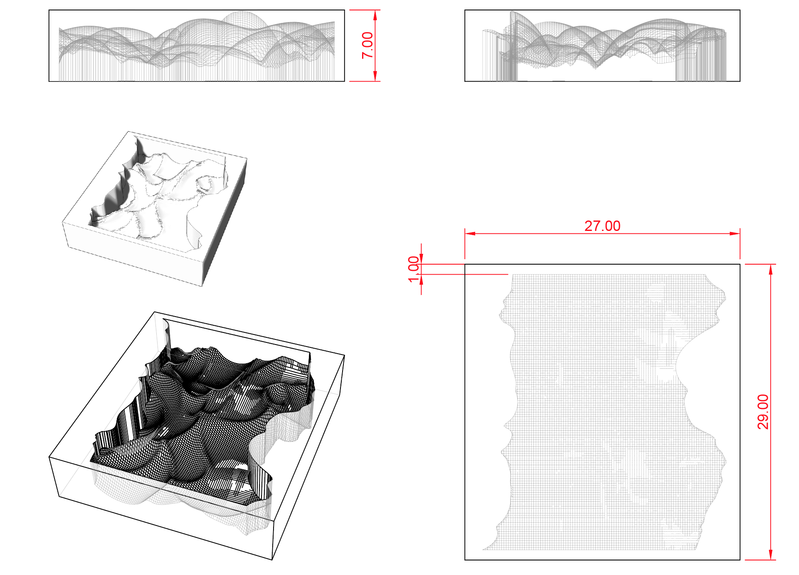
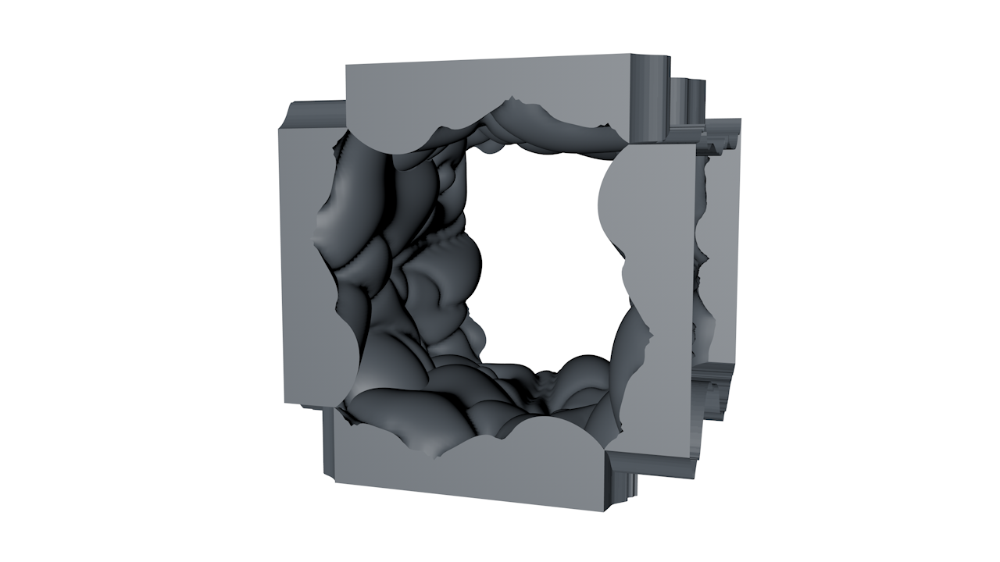
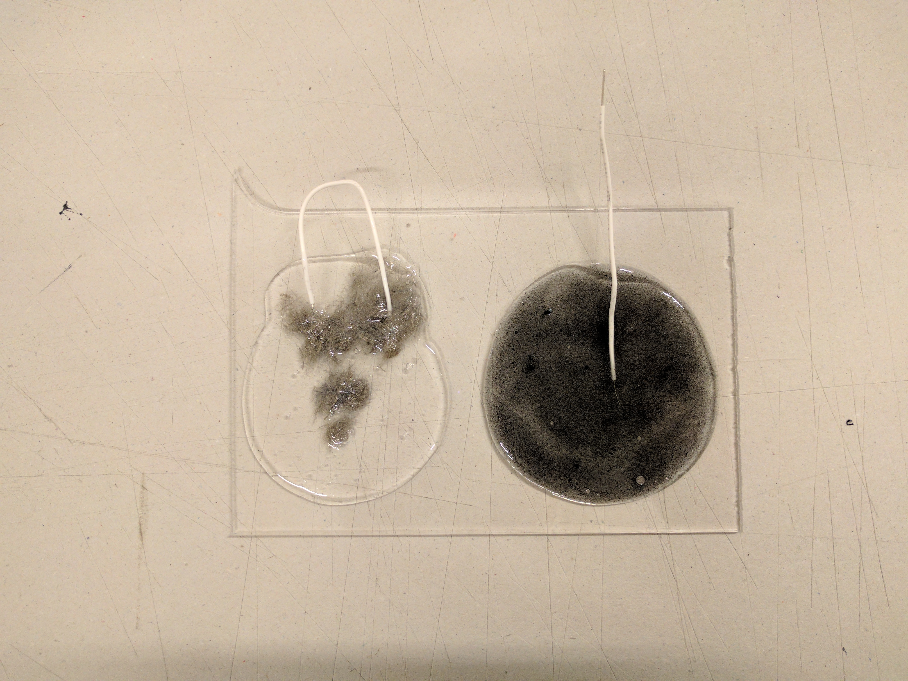
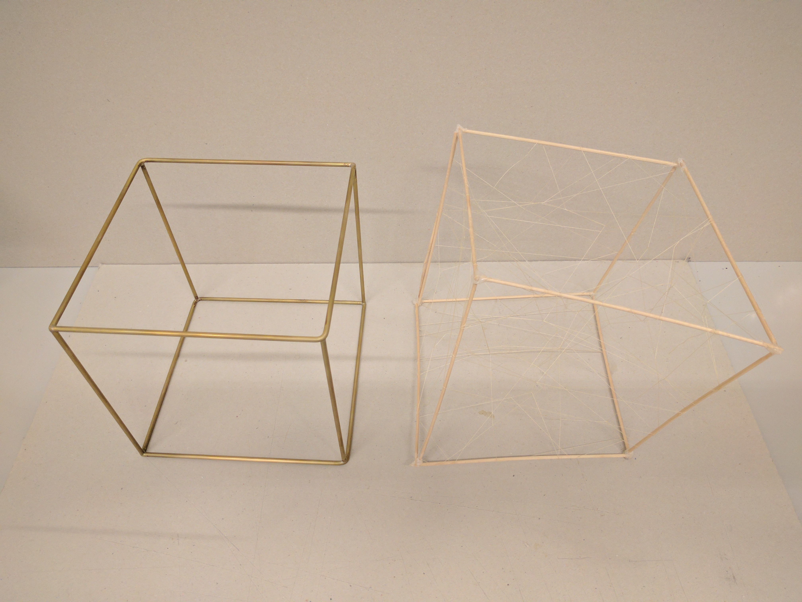
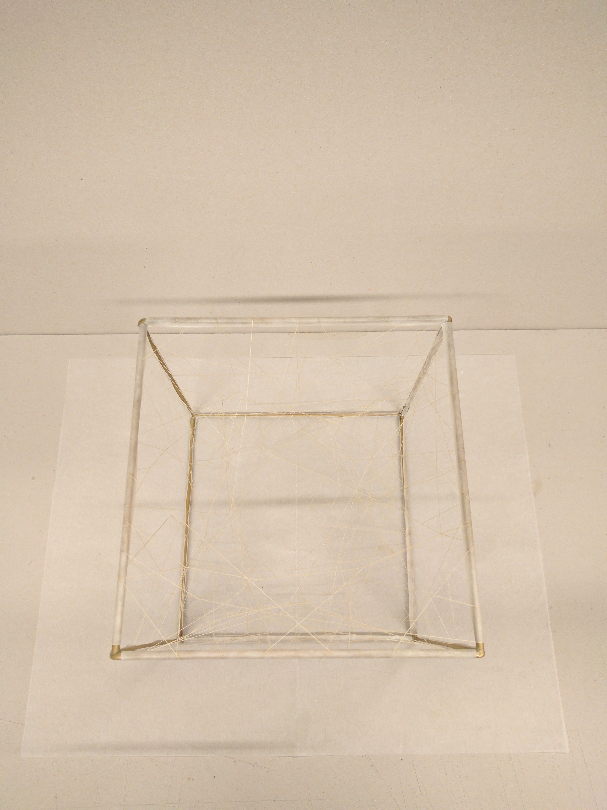
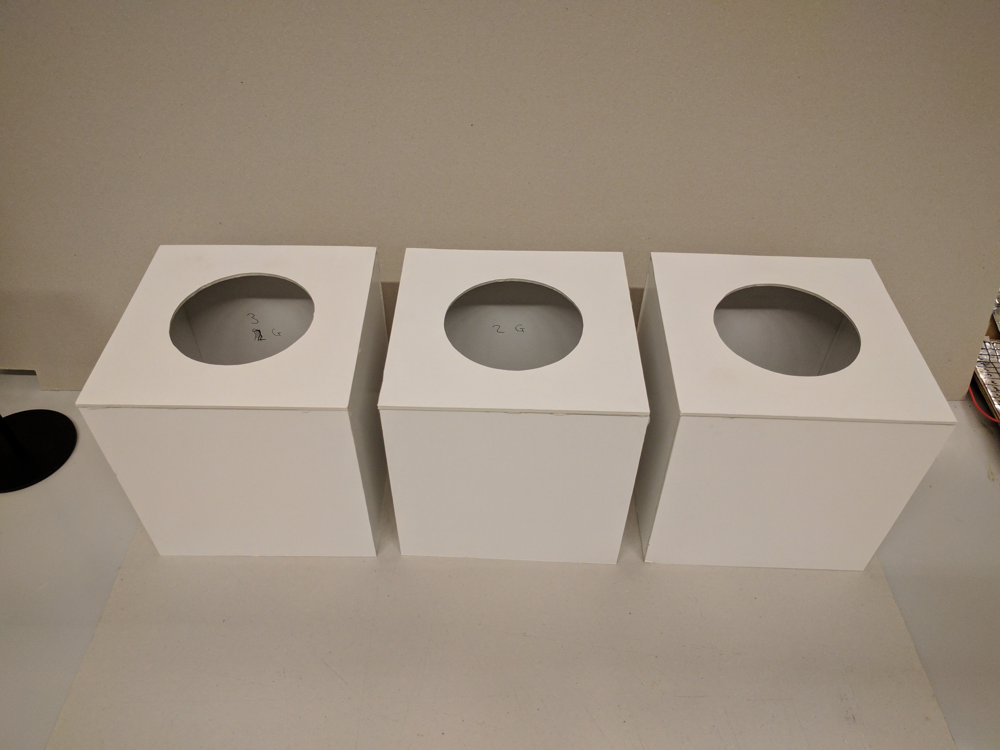

# Diploma project
This project is an attempt to create and establish a strong link between reality and Virtual Reality. In a way that reflect how to manipulate the reality and influence the virtual world and vice versa.

## Moodboard

## TODO | DONE
### Unity
- [ ] Create 3 difference environment for each box.
- [x] Make the animation of the explosion.
- [ ] ~~Every time the user approach one cube a new environment is loaded.~~
- [x] ~~Attach the player to the VR camera.~~
- [ ] When the user put his hand inside a cube the world inside explode out
- [ ] Improve the scripts for the serial communication between Unity and Arduino.
- [ ] A lot of more stuff in the codes

#### Some visuals
- [ ] Create a storyboard for my virtual universe

### Arduino
- [ ] Calibrate the 3D capacitive sensing controller, here the [values](https://docs.google.com/spreadsheets/d/1_88lRJ6wW6rSmD63nVG9YeYhz5aiGTSd5Py3lijk0ns/edit#gid=2112700507) I get.
/IMG_20170510_173310.jpg
- [x] [VL6180X](https://www.adafruit.com/product/3316) Time of Flight distance sensor prototyped, [Video](http://stellaspeziali.ch/diploma_project_doc/Time_of_Flight%20distance_sensor.mp4) of the test.
- [x] Photocells and optic fibre [I Need to document this].
- [x] FlexSensors.
- [ ] Haptic motor.
- [x] Conductive wire.
- [x] Silicone with conductive fibers from conductive wire.
- [ ] Put everything together.

#### 1. Bubble
- [x] Create a 3D model

- [x] CNC fabrication

- [x] Mix conductive fibers and conductive ink with the silicone

- [ ] Silicone mold x4
- [ ] Fill the mold with:
	- [ ] [Slime](https://www.instagram.com/explore/tags/slime/?hl=it) or
	- [ ] [Pearl clay](https://s-media-cache-ak0.pinimg.com/originals/c7/f3/d3/c7f3d376586a34ae77c89879f5f09bfa.jpg) or
	- [ ] other materials.

#### 2. Pics

- [ ] Create a better prototype using other elements like:
- [ ] brush hairs
- [ ] paper
- [ ] tissue
- [ ] neoprene
- [ ] others

#### 3. Wires

- [x] Create a metallic cube
- [x] Put some normal wires

- [ ] Put some conductive wire
- [ ] Make the lines move with:
	- [ ] Shape-memory alloy or
	- [ ] Mini vibrating motors.

#### Setup draf

- [ ] Draw some others setup.

## Planning manufacturing steps
- [x] 3x boxes prototyped

- [ ] build the finals object/s for the diploma that mean cuts, assembly and painting. [I'm still don't have any idea of the final form.]

### Materials to buy
- [ ] Glue
- [ ] [Jelly pearls](http://lqp-p-imgs.s3-ap-south-1.amazonaws.com/faceview/jh/ea/b5i/affimgs/az-large-184097.jpg)
- [ ] Silicone
- [ ] Black plexiglass
- [ ] Nice wood for the support of Oculus sensors
- [ ] For a table
- [ ] Electronics components

### Materials to rent
- [ ] Beamer

## Credits
By [Stella Speziali](https://stellaspeziali.myportfolio.com/) 
Diploma project 
Lead by Alain Bellet, Gaël Hugo, Cyril Diagne, Christophe Guignard 
Assisted by Tibor Udvari, David Roulin 
ECAL/Bachelor Media & Interaction Design 
University of Art & Design, Lausanne 2017 
[www.ecal.ch](www.ecal.ch)
